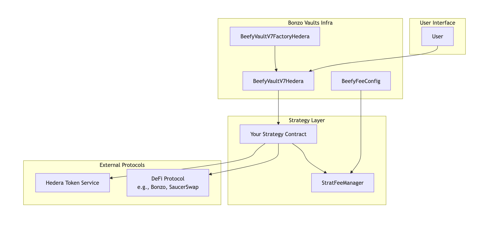

# Bonzo Vaults Strategy Development Guide for Hedera

This guide provides a step-by-step tutorial for developers new to Bonzo vaults who want to create a new strategy smart contract on the Hedera network.

## Table of Contents

1. [Overview](#overview)
2. [Strategy Architecture](#strategy-architecture)
3. [Contract Structure](#contract-structure)
4. [Step-by-Step Development](#step-by-step-development)
5. [Deployment Process](#deployment-process)
6. [Testing Strategies](#testing-strategies)
7. [Best Practices](#best-practices)
8. [Examples](#examples)

## Overview

Bonzo vaults strategies are yield-optimizing smart contracts that automatically compound rewards from various DeFi protocols. On Hedera, strategies must handle both standard ERC20 tokens and Hedera Token Service (HTS) tokens.

### Key Components

- **Strategy Contract**: Implements the yield optimization logic
- **Vault Contract**: User-facing contract that accepts deposits and issues shares
- **Factory Contract**: Deploys new vault instances
- **Fee Manager**: Handles fee distribution and access control

## Strategy Architecture



## Contract Structure

### Base Strategy Pattern

All Bonzo vaults strategies follow this inheritance pattern:

```solidity
contract YourStrategy is StratFeeManagerInitializable {
  using SafeERC20 for IERC20;

  // Required state variables
  address public want; // Deposit token
  address public output; // Reward token
  address public vault; // Vault contract

  // Protocol-specific variables
  address public lendingPool;
  address public rewardsController;

  // Hedera-specific
  bool public isHederaToken;
  address private constant HTS_PRECOMPILE = address(0x167);
  int64 private constant HTS_SUCCESS = 22;

  // Strategy settings
  bool public harvestOnDeposit;
  uint256 public lastHarvest;
}

```

### Required Functions

Every strategy must implement these core functions:

```solidity
// Core strategy interface
function deposit() external;

function withdraw(uint256 _amount) external;

function beforeDeposit() external;

function harvest() external;

function balanceOf() external view returns (uint256);

function balanceOfWant() external view returns (uint256);

function balanceOfPool() external view returns (uint256);

// Management functions
function retireStrat() external;

function panic() external;

function pause() external;

function unpause() external;

```

## Oracle Integration

### Bonzo Vaults Oracle (Supra)

For strategies that require price feeds for token swapping or valuation, Bonzo vaults provides oracle integration through the `BeefyOracleSupra` library. This oracle fetches price data from Supra Oracle feeds and scales them to 18 decimals for consistency.

#### Key Features

- **Price Fetching**: Retrieves asset prices from Supra Oracle feeds
- **Automatic Scaling**: Scales prices to 18 decimals regardless of source decimals
- **Data Validation**: Validates oracle data before use
- **Error Handling**: Graceful failure handling for unavailable price feeds

#### Usage in Strategies

```solidity
import "../../infra/BeefyOracle/BeefyOracleSupra.sol";

contract YourStrategy is StratFeeManagerInitializable {
  address public supraOracle;

  function getTokenPrice(address token) public view returns (uint256 price, bool success) {
    bytes memory data = abi.encode(supraOracle, token);
    return BeefyOracleSupra.getPrice(data);
  }

  function _swapTokens(uint256 amount) internal {
    // Get price for slippage calculation
    (uint256 outputPrice, bool success) = getTokenPrice(output);
    require(success, "Oracle price unavailable");

    // Calculate minimum amount out with slippage protection
    uint256 minAmountOut = (amount * outputPrice * (10000 - slippageTolerance)) / 10000;

    // Perform swap with price protection
    // ... swap logic
  }
}

```

#### Oracle Data Structure

The oracle uses encoded data containing:

- `address supraOracle`: The Supra Oracle contract address
- `address asset`: The asset address to get price for

#### Integration Example

```solidity
function initialize(
  // ... other parameters
  address _supraOracle,
  CommonAddresses calldata _commonAddresses
) public initializer {
  // ... other initialization
  supraOracle = _supraOracle;

  // Validate oracle connection
  bytes memory oracleData = abi.encode(_supraOracle, output);
  BeefyOracleSupra.validateData(oracleData);
}

```

#### Error Handling

The oracle library includes proper error handling:

```solidity
function _getTokenPriceWithFallback(address token) internal view returns (uint256) {
  (uint256 price, bool success) = getTokenPrice(token);
  if (!success) {
    // Fallback to alternative pricing method or revert
    revert("Price feed unavailable");
  }
  return price;
}

```

## Step-by-Step Development

### Step 1: Choose Your Base Class

For most strategies, inherit from `StratFeeManagerInitializable`:

```solidity
// SPDX-License-Identifier: MIT
pragma solidity ^0.8.0;

import "../Common/StratFeeManagerInitializable.sol";
import "../../interfaces/beefy/IStrategyV7.sol";

contract YourStrategy is StratFeeManagerInitializable {
  // Your implementation
}

```

### Step 2: Define State Variables

```solidity
contract YourStrategy is StratFeeManagerInitializable {
  using SafeERC20 for IERC20;

  // Core tokens
  address public want; // The token users deposit
  address public output; // The reward token from the protocol
  address public aToken; // Receipt token (for lending protocols)

  // External protocol contracts
  address public lendingPool;
  address public rewardsController;

  // Hedera Token Service integration
  bool public isHederaToken;
  address private constant HTS_PRECOMPILE = address(0x167);
  int64 private constant HTS_SUCCESS = 22;

  // Strategy configuration
  bool public harvestOnDeposit;
  uint256 public lastHarvest;

  // Events
  event StratHarvest(address indexed harvester, uint256 wantHarvested, uint256 tvl);
  event Deposit(uint256 tvl);
  event Withdraw(uint256 tvl);
}

```

### Step 3: Implement the Initializer

```solidity
function initialize(
  address _want,
  address _aToken,
  address _lendingPool,
  address _rewardsController,
  address _output,
  bool _isHederaToken,
  CommonAddresses calldata _commonAddresses
) public initializer {
  __StratFeeManager_init(_commonAddresses);

  want = _want;
  aToken = _aToken;
  lendingPool = _lendingPool;
  rewardsController = _rewardsController;
  output = _output;
  isHederaToken = _isHederaToken;

  // Associate HTS tokens if needed
  if (isHederaToken) {
    _associateToken(_want);
    if (_want != _output) {
      _associateToken(_output);
    }
  }

  _giveAllowances();
}

```

### Step 4: Implement Core Functions

#### Deposit Function

```solidity
function deposit() public whenNotPaused nonReentrant {
  uint256 wantBal = IERC20(want).balanceOf(address(this));
  require(wantBal > 0, "No funds to deposit");

  // Deposit into the external protocol
  ILendingPool(lendingPool).deposit(want, wantBal, address(this), 0);

  emit Deposit(balanceOf());
}

```

#### Withdraw Function

```solidity
function withdraw(uint256 _amount) external nonReentrant {
  require(msg.sender == vault, "!vault");
  require(_amount > 0, "Amount must be greater than 0");

  uint256 wantBal = IERC20(want).balanceOf(address(this));

  // Withdraw from protocol if needed
  if (wantBal < _amount) {
    ILendingPool(lendingPool).withdraw(want, _amount - wantBal, address(this));
    wantBal = IERC20(want).balanceOf(address(this));
  }

  // Apply withdrawal fee if applicable
  if (tx.origin != owner() && !paused()) {
    uint256 withdrawalFeeAmount = (_amount * withdrawalFee) / WITHDRAWAL_MAX;
    _amount = _amount - withdrawalFeeAmount;
  }

  _safeTransfer(want, address(this), vault, _amount);
  emit Withdraw(balanceOf());
}

```

#### Harvest Function

```solidity
function harvest() external virtual nonReentrant {
  _harvest(tx.origin);
}

function _harvest(address callFeeRecipient) internal whenNotPaused {
  // Claim rewards from protocol
  address[] memory assets = new address[](1);
  assets[0] = aToken;

  uint256 rewardAmount = IRewardsController(rewardsController).getUserRewards(assets, address(this), output);

  if (rewardAmount > 0) {
    IRewardsController(rewardsController).claimRewards(assets, rewardAmount, address(this), output);
  }

  uint256 outputBal = IERC20(output).balanceOf(address(this));
  if (outputBal > 0) {
    chargeFees(callFeeRecipient);
    uint256 wantHarvested = balanceOfWant();
    deposit();

    lastHarvest = block.timestamp;
    emit StratHarvest(msg.sender, wantHarvested, balanceOf());
  }
}

```

### Step 5: Implement Hedera Token Service Support

```solidity
function _associateToken(address token) internal {
  (bool success, bytes memory result) = HTS_PRECOMPILE.call(
    abi.encodeWithSelector(IHederaTokenService.associateToken.selector, address(this), token)
  );
  int64 responseCode = success ? abi.decode(result, (int64)) : -2;
  require(responseCode == HTS_SUCCESS, "HTS token association failed");
}

function _safeTransfer(
  address token,
  address from,
  address to,
  uint256 amount
) internal {
  if (isHederaToken) {
    _transferHTS(token, from, to, int64(uint64(amount)));
  } else {
    IERC20(token).safeTransfer(to, amount);
  }
}

function _transferHTS(
  address token,
  address from,
  address to,
  int64 amount
) internal {
  (bool success, bytes memory result) = HTS_PRECOMPILE.call(
    abi.encodeWithSelector(IHederaTokenService.transferToken.selector, token, from, to, amount)
  );
  int64 responseCode = success ? abi.decode(result, (int64)) : -2;
  require(responseCode == HTS_SUCCESS, "HTS token transfer failed");
}

```

## Deployment Process

### Step 1: Deploy Infrastructure (One-time)

First, ensure the Bonzo vaults infrastructure is deployed:

```javascript
// Deploy vault factory
const BeefyVaultV7FactoryHedera = await ethers.getContractFactory("BeefyVaultV7FactoryHedera");
const vaultFactory = await BeefyVaultV7FactoryHedera.deploy();

// Deploy fee config
const BeefyFeeConfig = await ethers.getContractFactory("BeefyFeeConfig");
const feeConfig = await BeefyFeeConfig.deploy();
```

### Step 2: Deploy Your Strategy

```javascript
// Deploy strategy
const YourStrategy = await ethers.getContractFactory("YourStrategy");
const strategy = await YourStrategy.deploy();
await strategy.deployed();

console.log("Strategy deployed to:", strategy.address);
```

### Step 3: Create and Initialize Vault

```javascript
// Connect to vault factory
const vaultFactory = await ethers.getContractAt("BeefyVaultV7FactoryHedera", VAULT_FACTORY_ADDRESS);

// Create new vault
const tx = await vaultFactory.cloneVault();
const receipt = await tx.wait();

// Get vault address from event
const proxyCreatedEvent = receipt.events?.find(e => e.event === "ProxyCreated");
const vaultAddress = proxyCreatedEvent?.args?.proxy;

// Connect to vault
const vault = await ethers.getContractAt("BeefyVaultV7Hedera", vaultAddress);
```

### Step 4: Initialize Contracts

```javascript
// Initialize strategy
const commonAddresses = {
  vault: vaultAddress,
  keeper: KEEPER_ADDRESS,
  strategist: STRATEGIST_ADDRESS,
  unirouter: UNIROUTER_ADDRESS,
  bonzoVaultsFeeRecipient: FEE_RECIPIENT_ADDRESS,
  bonzoVaultsFeeConfig: FEE_CONFIG_ADDRESS,
};

await strategy.initialize(
  WANT_TOKEN_ADDRESS,
  ATOKEN_ADDRESS,
  LENDING_POOL_ADDRESS,
  REWARDS_CONTROLLER_ADDRESS,
  OUTPUT_TOKEN_ADDRESS,
  true, // isHederaToken
  commonAddresses
);

// Initialize vault
await vault.initialize(
  strategy.address,
  "Bonzo Vaults Your Token Strategy",
  "bvYOUR-TOKEN",
  0, // approval delay
  true // isHederaToken
);
```

## Testing Strategies

### Test File Structure

Create comprehensive tests following this pattern:

```typescript
// test/Hedera/BonzoVaultsYourStrategy.test.ts
import { ethers } from "hardhat";
import { expect } from "chai";
import { SignerWithAddress } from "@nomiclabs/hardhat-ethers/signers";
import addresses from "../../scripts/deployed-addresses.json";

describe("BonzoVaultsYourStrategy", function () {
  let vault: any;
  let strategy: any;
  let want: any;
  let deployer: SignerWithAddress;

  // Use addresses from deployed-addresses.json
  const VAULT_FACTORY_ADDRESS = addresses.vaultFactory;
  const FEE_CONFIG_ADDRESS = addresses.beefyFeeConfig;
  const BONZO_VAULTS_FEE_RECIPIENT = addresses.beefyFeeRecipient;
  const STRATEGY_OWNER = addresses.strategyOwner;
  const VAULT_OWNER = addresses.vaultOwner;
  const KEEPER = addresses.keeper;

  before(async () => {
    [deployer] = await ethers.getSigners();
    // Setup deployment or connect to existing contracts
  });

  describe("Strategy Initialization", () => {
    it("should have correct initial parameters", async function () {
      // Test initialization
    });

    it("should have correct vault configuration", async function () {
      // Test vault setup
    });
  });

  describe("Deposit and Withdraw", () => {
    it("should handle deposits correctly", async function () {
      // Test deposit functionality
    });

    it("should handle withdrawals correctly", async function () {
      // Test withdrawal functionality
    });
  });

  describe("Harvest Functionality", () => {
    it("should harvest rewards correctly", async function () {
      // Test harvest mechanism
    });
  });

  describe("Emergency Functions", () => {
    it("should pause and unpause correctly", async function () {
      // Test emergency controls
    });
  });
});
```

### Test Categories

Include tests for:

1. **Strategy Initialization**

   - Correct parameter setup
   - Token associations
   - Allowances

2. **Deposit and Withdraw**

   - Basic deposit/withdraw functionality
   - Fee calculations
   - Edge cases (zero amounts, insufficient balance)

3. **Harvest Functionality**

   - Reward claiming
   - Fee distribution
   - Compounding

4. **Access Control**

   - Vault-only functions
   - Manager-only functions
   - Owner restrictions

5. **Emergency Functions**

   - Pause/unpause mechanism
   - Panic function
   - Strategy retirement

6. **Edge Cases**
   - Zero balances
   - Token transfer failures
   - Protocol failures

### Running Tests

```bash
# Run specific test file
npx hardhat test test/Hedera/BonzoVaultsYourStrategy.test.ts --network hedera_testnet

# Run all tests
npx hardhat test --network hedera_testnet

# Run with gas reporting
REPORT_GAS=true npx hardhat test --network hedera_testnet
```

## Best Practices

### Security Considerations

1. **Use Initializable Pattern**: Always use initializable contracts for upgradeability
2. **Reentrancy Guards**: Protect state-changing functions
3. **Access Control**: Properly restrict sensitive functions
4. **Input Validation**: Validate all user inputs
5. **Emergency Controls**: Implement pause and panic mechanisms

### Hedera-Specific Best Practices

1. **HTS Token Handling**:

   - Always associate tokens before use
   - Use proper transfer methods for HTS vs ERC20
   - Handle association failures gracefully

2. **Gas Optimization**:

   - Be mindful of transaction costs on Hedera
   - Batch operations when possible
   - Use efficient data structures

3. **Error Handling**:
   - Implement proper error messages
   - Handle HTS response codes
   - Graceful degradation for missing functions

### Code Quality

1. **Documentation**: Comment complex logic thoroughly
2. **Events**: Emit events for all important state changes
3. **Testing**: Achieve high test coverage
4. **Modularity**: Keep functions focused and reusable

## Examples

### Simple Supply Strategy (Bonzo)

See `contracts/BIFI/strategies/Bonzo/BonzoSupplyStrategy.sol` for a basic lending strategy.

**Key Features:**

- Single-token deposit/withdraw
- Reward harvesting
- HTS token support

### Leveraged Strategy (Yield Loop)

See `contracts/BIFI/strategies/Bonzo/YieldLoopConfigurable.sol` for an advanced leveraged strategy.

**Key Features:**

- Configurable leverage loops
- Risk management
- Complex position management

### Liquidity Provider Strategy (SaucerSwap)

See `contracts/BIFI/strategies/SaucerSwap/StrategyCommonSaucerSwap.sol` for LP strategies.

**Key Features:**

- Dual-token management
- Liquidity position handling
- Impermanent loss considerations

## Troubleshooting

### Common Issues

1. **HTS Association Failures**

   - Ensure proper token association before transfers
   - Check response codes from HTS precompile

2. **Access Control Errors**

   - Verify deployer has correct permissions
   - Check vault-strategy relationship

3. **Test Failures**
   - Use try-catch for optional functions
   - Handle permission errors gracefully
   - Check token balances before operations

### Debugging Tips

1. Use console.log for debugging test issues
2. Check transaction receipts for revert reasons
3. Verify contract addresses in deployed-addresses.json
4. Test with small amounts first

## Additional Resources

- [Bonzo Vaults Documentation](https://docs.beefy.finance/)
- [Hedera Documentation](https://docs.hedera.com/)
- [OpenZeppelin Contracts](https://docs.openzeppelin.com/contracts/)
- [Hardhat Framework](https://hardhat.org/docs)

---

For questions or support, reach out to the Bonzo vaults development team or check the project's GitHub repository.
